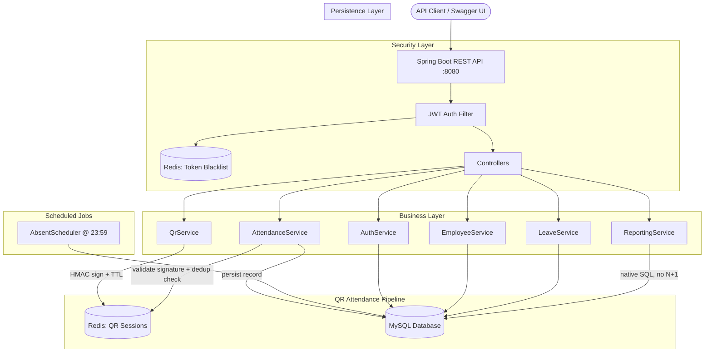
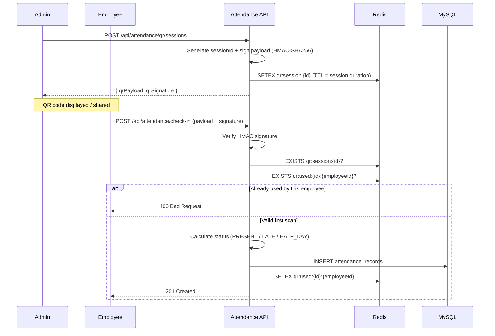
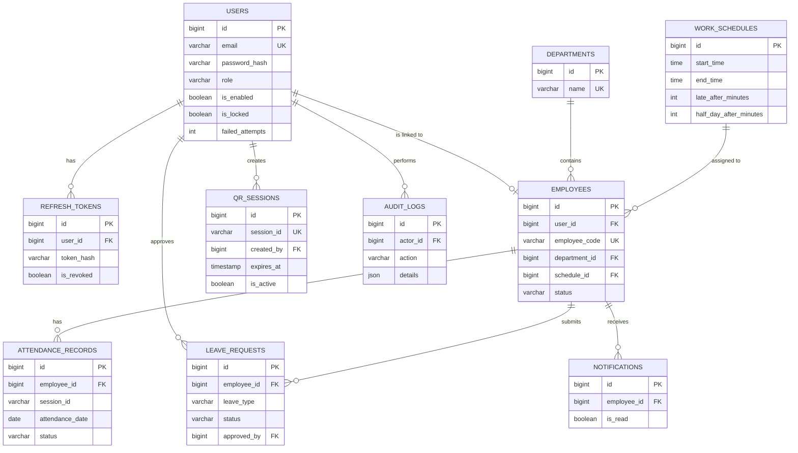

<div align="center">


<br/>

**Production-grade REST API for workforce attendance management.**
QR-based check-in with HMAC-signed sessions, role-based access control, automated leave-to-attendance reconciliation, and native-SQL reporting — built phase by phase with full architectural ownership.

<br/>


[](#-system-architecture)
[](#-security)
[](#-qr-check-in-flow)

</div>

---

## 📋 Table of Contents

- [Overview](#-overview)
- [System Architecture](#-system-architecture)
- [QR Check-In Flow](#-qr-check-in-flow)
- [Features](#-features)
- [API Reference](#-api-reference)
- [Database Schema](#-database-schema)
- [Tech Stack](#-tech-stack)
- [Security](#-security)
- [Known Limitations](#-known-limitations)
- [Getting Started](#-getting-started)
- [Author](#-author)

---

## 🌐 Overview

**Attendance Management API** solves the core trust problem in digital attendance systems: how do you prove an employee was physically present, without GPS, while still preventing fraud?

The answer here is a **time-boxed, cryptographically signed QR session**. An admin generates a session, it's signed with HMAC-SHA256, cached in Redis with a TTL, and any employee can scan it — but each employee can only use it **once**. No global lockout, no GPS dependency, no client-side trust.

### Design decisions that go beyond a typical CRUD API

| Challenge | How it's solved |
|---|---|
| One QR code shouldn't lock out the rest of the team | Per-employee Redis key (`qr:used:{sessionId}:{employeeId}`), not a single-use global flag |
| QR tokens must be tamper-proof without a database round-trip | HMAC-SHA256 signed payload — validity checked before touching MySQL |
| QR sessions must expire automatically | Redis `SETEX` with TTL matching the session duration — no manual cleanup job |
| Late vs. half-day is not a fixed rule | Per-schedule configurable thresholds (`lateAfterMinutes`, `halfDayAfterMinutes`) calculated at check-in time |
| Approved leave must reconcile with attendance | `LeaveService` backfills or overwrites `attendance_records` for every day in the leave range on approval |
| Employees who never check in still need a status | Daily `@Scheduled` job marks unrecorded `ACTIVE` employees as `ABSENT` at 23:59 |
| Reports need multi-table aggregation without N+1 | Reporting layer uses native SQL via `EntityManager`, including a recursive CTE for date-range absence reports |

---

## 🏗️ System Architecture



**Communication:**
- `───►` Synchronous (blocking REST call)
- All session state (QR validity, per-employee usage, token blacklist) lives in **Redis**, not MySQL — keeping the hot path off the relational database.

---

## 🔄 QR Check-In Flow



---

## ✨ Features

### 🔐 Authentication & Security
- JWT access tokens (15 min) + rotating refresh tokens (7 days, hashed in DB)
- Account lockout after 5 failed login attempts
- Stateless sessions — token revocation via Redis blacklist on logout
- BCrypt password hashing

### 👥 Role-Based Access Control
Three roles enforced at the method level via `@PreAuthorize`:

| Role | Scope |
|---|---|
| `SUPER_ADMIN` | Full system access — users, departments, schedules, deletions |
| `HR_MANAGER` | Employees, attendance, leave approval, reporting |
| `EMPLOYEE` | Own attendance, leave submission, notifications |

### 🏢 Workforce Management
- Department CRUD with delete-guard (blocks deletion if employees are assigned)
- Configurable work schedules — start/end time, late threshold, half-day threshold
- Employee lifecycle: create, transfer department, activate/deactivate

### 📲 QR Attendance Engine
- HMAC-SHA256 signed, time-boxed QR sessions
- Per-employee, per-session usage tracking in Redis (not a global one-time flag)
- Automatic status calculation: `PRESENT` / `LATE` / `HALF_DAY` based on schedule thresholds
- Daily scheduled job marks unrecorded employees `ABSENT`

### 🌴 Leave Management
- Submit leave with overlap detection against existing requests
- HR approval/rejection workflow with optional rejection reason
- On approval: automatically backfills or overwrites `attendance_records` for the full leave range as `ON_LEAVE`
- In-app notifications on every approval/rejection

### 📊 Reporting
- Daily attendance (all employees + live status)
- Monthly per-employee summary (status counts)
- Late arrivals with exact minutes-late calculation
- Absence report via recursive CTE (date range × active employees, anti-joined against records)
- Department-wise statistics
- All five reports support pagination (`?page=&size=&sort=`)

---

## 📡 API Reference

34 endpoints across 8 controllers · Full interactive docs at `/swagger-ui/index.html`

<p align="center">
  
</p>

| Method | Endpoint | Role | Description |
|---|---|---|---|
| `POST` | `/api/auth/login` | Public | Login → access + refresh token |
| `POST` | `/api/auth/refresh` | Public | Rotate refresh token |
| `POST` | `/api/auth/logout` | Bearer | Blacklist current access token |
| `PUT` | `/api/auth/change-password` | Bearer | Change own password |
| `POST` | `/api/employees` | Admin/HR | Create employee profile |
| `PUT` | `/api/employees/{id}/transfer` | Admin/HR | Transfer department |
| `PUT` | `/api/employees/{id}/status` | Admin/HR | Activate / deactivate |
| `POST` | `/api/attendance/qr/sessions` | Admin/HR | **Generate signed QR session** |
| `POST` | `/api/attendance/check-in` | Employee | **Scan QR → record attendance** |
| `GET` | `/api/attendance/today` | Admin/HR | Today's attendance snapshot |
| `POST` | `/api/leaves` | Employee | Submit leave request |
| `PUT` | `/api/leaves/{id}/review` | Admin/HR | Approve / reject |
| `GET` | `/api/reports/daily` | Admin/HR | Daily attendance report |
| `GET` | `/api/reports/monthly` | Admin/HR | Per-employee monthly summary |
| `GET` | `/api/reports/late-arrivals` | Admin/HR | Late arrivals in range |
| `GET` | `/api/reports/absences` | Admin/HR | Absence report (recursive CTE) |
| `GET` | `/api/reports/departments` | Admin/HR | Department-wise statistics |

<details>
<summary><b>📂 See all 34 endpoints</b></summary>

| Method | Endpoint |
|---|---|
| `POST` | `/api/users` |
| `GET` | `/api/users` |
| `GET` | `/api/users/{id}` |
| `PUT` | `/api/users/{id}` |
| `DELETE` | `/api/users/{id}` |
| `POST` | `/api/departments` |
| `GET` | `/api/departments` |
| `GET` | `/api/departments/{id}` |
| `PUT` | `/api/departments/{id}` |
| `DELETE` | `/api/departments/{id}` |
| `POST` | `/api/schedules` |
| `GET` | `/api/schedules` |
| `GET` | `/api/schedules/{id}` |
| `PUT` | `/api/schedules/{id}` |
| `DELETE` | `/api/schedules/{id}` |
| `GET` | `/api/employees` |
| `GET` | `/api/employees/{id}` |
| `PUT` | `/api/employees/{id}` |
| `DELETE` | `/api/attendance/qr/sessions/{sessionId}` |
| `GET` | `/api/attendance` |
| `POST` | `/api/leaves` |
| `GET` | `/api/leaves/my` |
| `GET` | `/api/leaves` |
| `GET` | `/api/notifications` |
| `GET` | `/api/notifications/unread` |
| `GET` | `/api/notifications/unread-count` |
| `PUT` | `/api/notifications/{id}/read` |
| `PUT` | `/api/notifications/read-all` |

</details>

### Sample: Login → Refresh Token Rotation

<p align="center">
  
</p>

---

## 🗄️ Database Schema

10 tables · 8 Flyway migrations · Generated from the live schema:

<p align="center">
  
</p>



---

## 🛠️ Tech Stack

| Layer | Technology | Purpose |
|---|---|---|
| Language | Java 21 | Core language |
| Framework | Spring Boot 4.0 | Application framework |
| Security | Spring Security + JJWT | Stateless JWT auth |
| Persistence | Spring Data JPA / Hibernate 7 | ORM & DB access |
| Database | MySQL 8 | Primary data store |
| Migrations | Flyway | Versioned schema (V1–V8) |
| Cache | Redis 7 | QR sessions, dedup keys, token blacklist |
| Reporting | `EntityManager` + native SQL | Multi-table aggregation, recursive CTE |
| Docs | SpringDoc OpenAPI 3 | Swagger UI |
| Build | Maven | Dependency management |
| Utilities | Lombok | Boilerplate reduction |
| Deployment | Docker Compose | MySQL + Redis + App, one command |

---

## 🔒 Security

- **Stateless JWT** — no server-side session, `SessionCreationPolicy.STATELESS`
- **HMAC-SHA256** signing on every QR payload — forged QR codes are rejected before any DB lookup
- **Refresh token rotation** — old token is revoked the moment a new one is issued
- **Account lockout** — 5 failed logins locks the account, requiring admin intervention
- **Token blacklist** — logout immediately invalidates the access token via Redis, with TTL matching remaining token life
- **Method-level RBAC** — every endpoint declares its allowed roles via `@PreAuthorize`, not just route-level filtering

---

## ⚠️ Known Limitations

| Limitation | Detail |
|---|---|
| Single-tenant | One company per deployment — no multi-tenant isolation yet |
| No GPS validation | QR signature + per-employee dedup is the fraud control, not location |
| In-memory token blacklist scope | Blacklist is Redis-backed but assumes a single Redis instance, not a cluster |
| `redis.keys()` on session cleanup | `deactivateSession` uses a key scan — acceptable at current scale, not ideal at high QR-session volume |

---

## 🚀 Getting Started

### Prerequisites
- Java 21+
- Docker & Docker Compose
- Maven 3.8+ (or use the included `mvnw`)

### Run with Docker Compose (recommended)

```bash
# 1. Clone
git clone https://github.com/MahmoudYoussef-web/attendance-management-api.git
cd attendance-management-api

# 2. Copy environment template
cp .env.example .env
# edit .env with your own secrets

# 3. Start everything (MySQL + Redis + App)
docker compose up -d

# 4. Open Swagger UI
open http://localhost:8080/swagger-ui/index.html
```

### Run locally (without Docker)

```bash
# 1. Create database
mysql -u root -p -e "CREATE DATABASE attendance_db;"

# 2. Configure backend/src/main/resources/application.yaml
spring:
  datasource:
    url: jdbc:mysql://localhost:3306/attendance_db
    username: your_username
    password: your_password
  data:
    redis:
      host: localhost
      port: 6379

jwt:
  secret: your_strong_secret_key_min_32_chars

# 3. Run
cd backend
./mvnw spring-boot:run
```

### Bootstrap Admin

| Field | Value |
|---|---|
| Email | `admin@example.com` |
| Password | `Admin@123` |
| Role | `SUPER_ADMIN` |

Created automatically on first startup when the `users` table is empty.

---

## 👤 Author

<table>
  <tr>
    <td align="center" width="300">
      <b>Mahmoud Youssef</b><br/>
      <sub>Backend Engineer</sub><br/><br/>
      <a href="https://github.com/MahmoudYoussef-web">
        
      </a>
      <br/>
      <a href="https://www.linkedin.com/in/mahmoud-youssef-ba30723bb">
        
      </a>
    </td>
  </tr>
</table>

---

<div align="center">
  <sub>Built phase by phase — Auth → Core Entities → QR Attendance Engine → Leave Management → Reporting → Production Polish.</sub>
</div>
